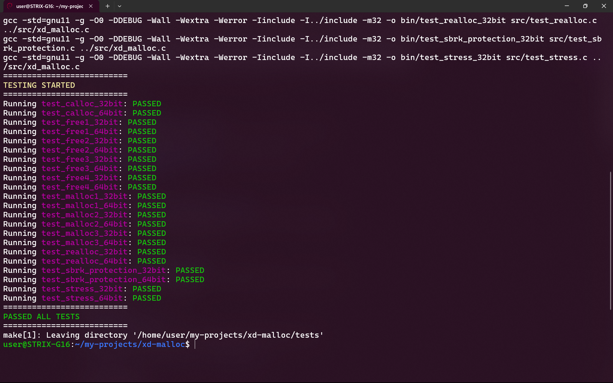

# 💾 XD-Malloc

Dynamic heap memory allocator library written in C.

---


## 🌟 Features 

- **Full memory allocation API**: Includes `xd_malloc()`, `xd_calloc()`, `xd_realloc()`, and `xd_free()`.
- **Thread-safe operations**: Safe to use in multi-threaded environments.
- **Small metadata overhead**: Each memory block contains a small header (8 or 16 bytes based on the architecture) used for efficient allocation and deallocation.
- **Dynamic free list**: Tracks free memory blocks using a doubly-linked list with pointers embedded directly in the free blocks (no additional memory overhead).
- **Efficient memory reuse**: Minimizes fragmentation by splitting blocks larger than the requested size and coalescing adjacent free blocks in constant time O(1).
- **Page-aligned arenas**: Acquires memory from the OS in 4 KB chunks to reduce system call overhead.
- **Isolated memory arenas**: Separates each memory arena with protective boundaries (fenceposts) to prevent cross-arena corruption.
- **Heap corruption detection**: Detects external heap break (`brk`) change and disables the allocator to avoid undefined behavior.
- **8-byte alignment**: Ensures memory blocks are always aligned to 8-bytes for compatibility.
- **Configurable allocation policy**: Uses first-fit by default, supports best-fit by defining the macro `XD_USE_BEST_FIT`.
- **Architecture support**: Works on both 32-bit and 64-bit systems.

---

## ✅ Testing

The allocator has been tested and verified to work correctly on both 32-bit and 64-bit systems. The repository includes automated test cases, and additional manual tests have also been performed to ensure reliability.

The screenshot below shows a successful test run using:

```bash
make run_tests
```



---

## 🤝 Feedback / Contributions

Suggestions, improvements, and bug reports are welcome!  
Feel free to open an issue or submit a pull request.

---

## 📜 License

This project is released under the MIT License. See [LICENSE](LICENSE) for details.
